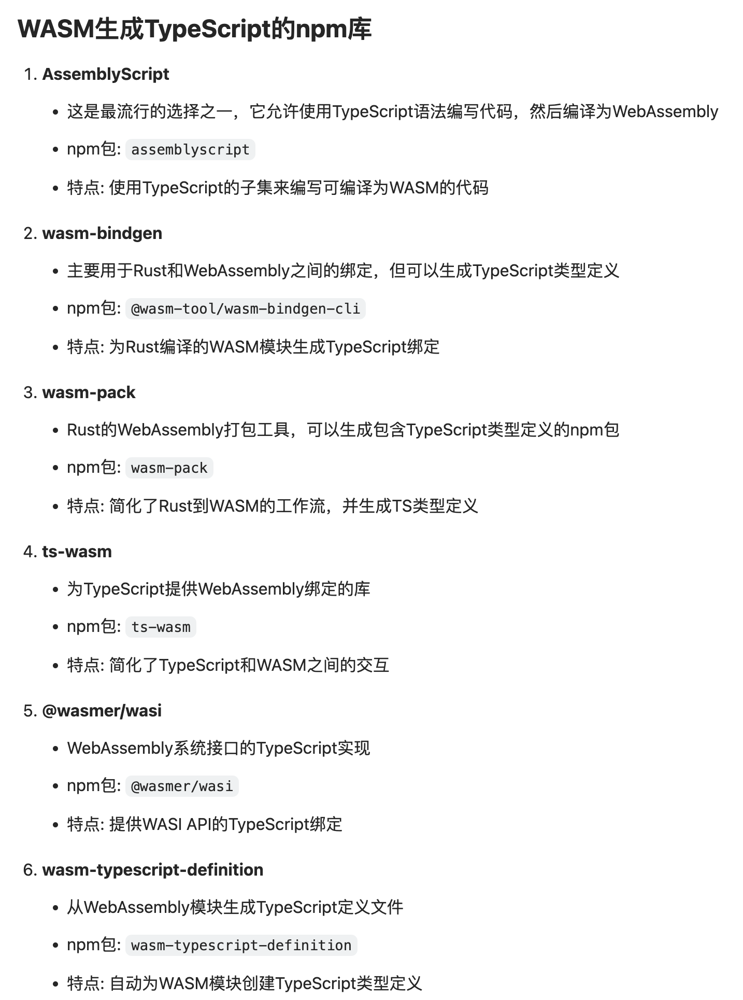

# 一些 webassembly 的 typescript 类型工具

tsembind: 一个可以从现有 Embind 库生成 TypeScript 类型定义的工具
emscripdtsgen: 另一个用于从 Embind 绑定生成 TypeScript 声明的工具

# vite server 的配置

```js
 server: {
    headers: {
      "Cross-Origin-Embedder-Policy": "require-corp",
      "Cross-Origin-Opener-Policy": "same-origin"
    }
  },
```

# WASM生成TypeScript的npm库


